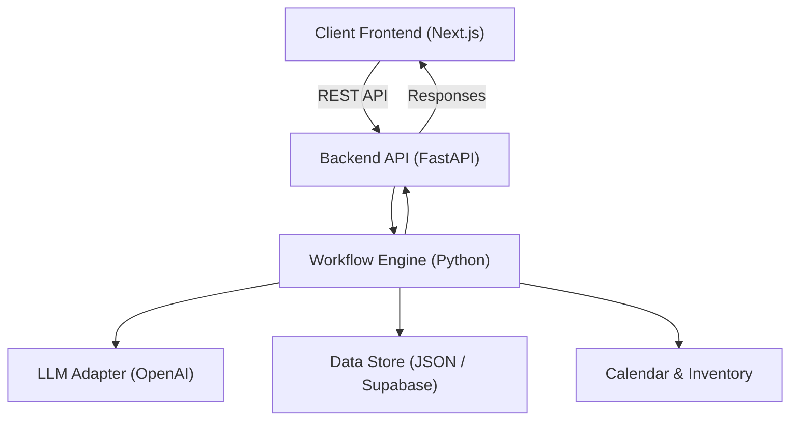

# OpenEvent-AI: The Autonomous Venue Booking Engine

OpenEvent-AI is a sophisticated, full-stack system designed to automate the end-to-end venue booking flow for "The Atelier". It combines the flexibility of Large Language Models (LLMs) with the reliability of deterministic state machines to handle inquiries, negotiate offers, and confirm bookings with "Human-In-The-Loop" (HIL) oversight.

## 🚀 Overview

The system ingests client inquiries (currently simulated via chat), maintains a deterministic event record, and coordinates every step of the booking process. Unlike simple chatbots, OpenEvent-AI is built on a **workflow engine** that tracks the lifecycle of an event from a "Lead" to a "Confirmed" booking.

### Key Features
- **Deterministic Workflow**: A 7-step state machine ensures no inquiry is lost and every booking follows the strict business rules.
- **Hybrid AI/Logic**: Uses LLMs for Natural Language Understanding (NLU) and drafting responses, but relies on rigid Python logic for pricing, availability, and state transitions.
- **"Safety Sandwich"**: A unique architectural pattern where LLM outputs are "sandwiched" between deterministic fact-extraction and verification layers to prevent hallucinations (e.g., inventing prices or rooms).
- **Human-In-The-Loop (HIL)**: Critical actions (sending offers, confirming dates) generate "Tasks" that require manager approval before proceeding.
- **Seamless Detours**: Clients can change their minds (e.g., "Actually, I need a bigger room") at any point, and the system intelligently "detours" to the previous necessary step without losing context.

---

## 🏗 Architecture

The system is composed of two main applications:



### 1. Frontend (`atelier-ai-frontend/`)
A **Next.js 15** application that serves as the user interface for:
- **Clients**: To chat with the AI assistant.
- **Managers**: To review HIL tasks, configure global settings (deposits, pricing), and monitor active events.

### 2. Backend (`backend/`)
A **Python FastAPI** application that acts as the brain. It exposes endpoints for the frontend and hosts the `workflow_email.py` orchestrator.

- **Orchestrator (`backend/workflow_email.py`)**: The central nervous system. It receives messages, loads state, executes the current step's logic, and persists the result.
- **Groups (`backend/workflows/groups/`)**: Logic is divided into "Groups" corresponding to workflow steps (e.g., `intake`, `room_availability`, `offer`).
- **NLU/Detectors (`backend/workflows/nlu/`)**: Specialized modules that analyze text to detect intents (e.g., `site_visit_detector`, `general_qna_classifier`).

---

## 🕵️ Detectors & Cost Efficiency

The system avoids "always-on" LLM calls by using a tiered detection architecture. Cheap, fast methods (Regex/Keywords) run first; expensive LLMs run only when necessary.

### 1. Intent Classifier (The Main Router)
*   **Purpose:** Decides if a message is an event request, a confirmation, or a question.
*   **Mechanism:**
    1.  **Gibberish Gate (Regex):** Immediately catches keyboard mashing ("asdfghjkl"). **Cost: $0**.
    2.  **Resume Check (Keywords):** Detects simple confirmations ("yes", "ok", "proceed"). **Cost: $0**.
    3.  **LLM Classifier:** Only runs if previous checks fail. Uses a specialized prompt to categorize intent.

### 2. General Q&A Classifier
*   **Purpose:** Detects vague availability questions (e.g., "What do you have free in March?").
*   **Mechanism:**
    1.  **Quick Scan (Regex):** Checks for question marks, month names, and "availability" keywords.
    2.  **LLM Extractor:** Only fires if the scan finds potential constraints (e.g., "March", "30 people") that need structured extraction.
*   **Efficiency:** Questions like "Do you have parking?" are caught by keywords and routed to the FAQ module without an extraction LLM call.

### 3. Change & Detour Detector
*   **Purpose:** Detects when a user wants to change a previously agreed variable (Date, Room, Requirements).
*   **Mechanism:** **Dual-Condition Logic**. A change is only triggered if **BOTH** are present:
    1.  **Revision Signal:** A verb like "change", "switch", "actually", "instead".
    2.  **Bound Target:** A reference to a variable ("date", "room") or a specific value ("2025-05-20").
*   **Efficiency:** Prevents false positives. A message like "What dates are free?" (Question) is not mistaken for "Change date" (Action).

### 4. Nonsense / Off-Topic Gate
*   **Purpose:** Silently ignores irrelevant messages to save costs and avoid confusing users.
*   **Mechanism:**
    1.  **Signal Check:** Scans for *any* workflow-relevant keyword (dates, numbers, "booking").
    2.  **Confidence Check:** If no signal is found and the LLM confidence is < 15%, the message is silently ignored.
*   **Cost:** **$0**. Uses existing confidence scores; no new LLM call.

### 5. Safety Sandwich (Hallucination Detector)
*   **Purpose:** Ensures the LLM doesn't invent prices or facts.
*   **Mechanism:**
    1.  **Deterministic Input:** Python calculates the exact price list.
    2.  **LLM Generation:** The AI writes the email body.
    3.  **Regex Verification:** The system scans the output. If the prices/dates don't match the input, it forces a retry or falls back to a template.

---

## 🧠 Core Concepts

### The 7-Step Workflow
1.  **Intake**: Classify intent, capture contact info, and understand requirements.
2.  **Date Confirmation**: Propose and lock in a specific date.
3.  **Room Availability**: Check inventory, handle conflicts, and select a room.
4.  **Offer**: Generate a priced offer (PDF/Text) with deposits and policies.
5.  **Negotiation**: Handle counter-offers and questions.
6.  **Transition**: Final prerequisites check.
7.  **Confirmation**: Payment processing and final booking confirmation.

### Entry & Hash Guards
- **Entry Guards**: Each step has strict entry requirements (e.g., "You cannot enter Step 3 without a confirmed date in Step 2").
- **Hash Guards**: To save compute and API costs, steps calculate a "requirements hash". If the user's input hasn't changed the requirements, the expensive availability calculation is skipped.

---

## 📂 Project Structure

```text
/
├── atelier-ai-frontend/    # Next.js Frontend application
├── backend/                # Python Backend application
│   ├── api/                # FastAPI endpoints
│   ├── main.py             # App entry point
│   ├── workflow_email.py   # Core State Machine Orchestrator
│   └── workflows/          # Business Logic
│       ├── groups/         # Ste
p implementations (intake, offer, etc.)
│       ├── nlu/            # Detectors & Classifiers (Regex + LLM)
│       └── io/             # Database & Task Management
├── docs/                   # Detailed documentation & rules
└── tests/                  # Pytest suite
```

---

## 🚦 Getting Started

### Prerequisites
- **Python 3.10+**
- **Node.js 18+**
- **OpenAI API Key** (Set as `OPENAI_API_KEY` env var)

### 1. Setup Backend
```bash
cd backend
# Create virtual environment (optional but recommended)
python -m venv venv
source venv/bin/activate

# Install dependencies
pip install -r requirements-dev.txt

# Run the API
# Note: Ensure you are in the project root
export PYTHONPATH=$PYTHONPATH:.
uvicorn backend.main:app --reload --port 8000
```

### 2. Setup Frontend
```bash
cd atelier-ai-frontend
npm install
npm run dev
```
The frontend will be available at `http://localhost:3000`.

### 3. Run Tests
The project has a comprehensive regression suite.
```bash
# Run all tests
pytest

# Run specific workflow tests
pytest backend/tests/workflows/test_workflow_v3_alignment.py
```

---

## 🛠 Current Status & Configuration

### Recent Updates
- **Supabase Integration**: Can be toggled via `OE_INTEGRATION_MODE=supabase`.
- **Site Visit Logic**: Dedicated sub-flow for handling venue tours.
- **Deposit Configuration**: Managers can now set global deposit rules.

### Configuration
Key environment variables (create a `.env` file):
- `OPENAI_API_KEY`: Required for NLU and Verbalizer.
- `OE_INTEGRATION_MODE`: `json` (default) or `supabase`.
- `WF_DEBUG_STATE`: Set to `1` for verbose workflow logging.

---

## 📚 Documentation
For deeper dives into specific subsystems:
- **[Workflow Rules](docs/workflow_rules.md)**: The "Constitution" of the booking logic.
- **[Team Guide](docs/TEAM_GUIDE.md)**: Best practices and troubleshooting.
- **[Integration Guide](docs/INTEGRATION_PREPARATION_GUIDE.md)**: How to deploy and connect to real infrastructure.
- **[Dev Changelog](DEV_CHANGELOG.md)**: Day-by-day summary of new features, fixes, and experiments.
- **[Open Decisions](docs/internal/OPEN_DECISIONS.md)**: Documented architecture choices and the reasoning behind them.
- **[Change Propagation Readme](docs/internal/CHANGE_PROPAGATION_README.md)**: How updates move through the repo and what to touch when.
- **[Implementation Plans](docs/plans/)**: Deep-dive project plans (multi-tenant rollout, detection revamp, calendar integration, etc.).
