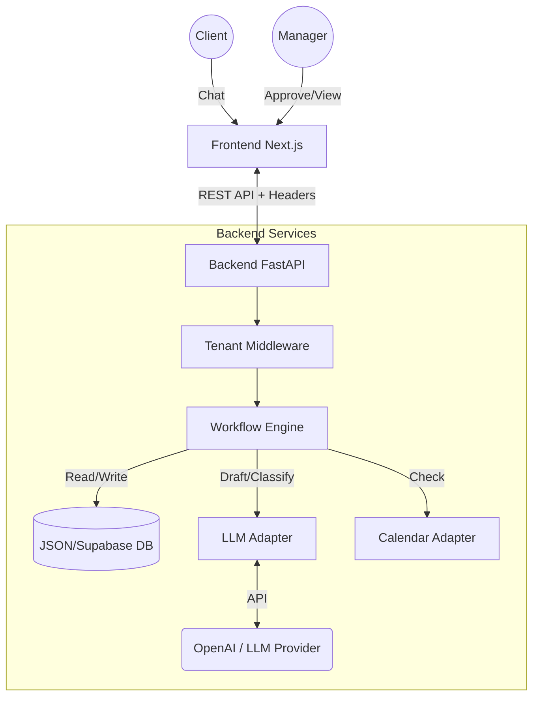
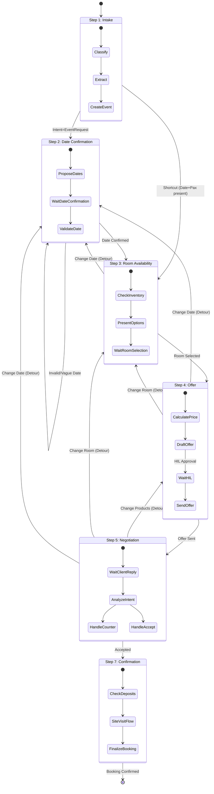
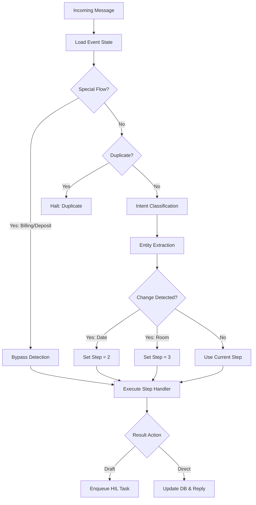
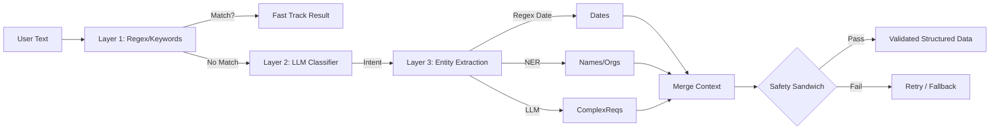
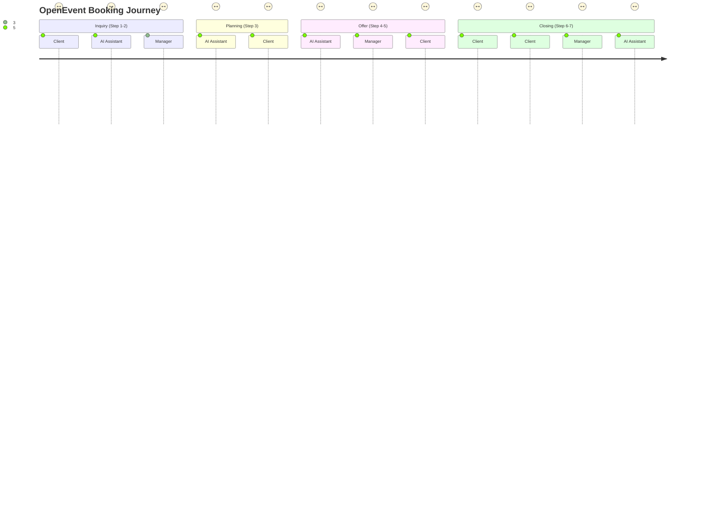
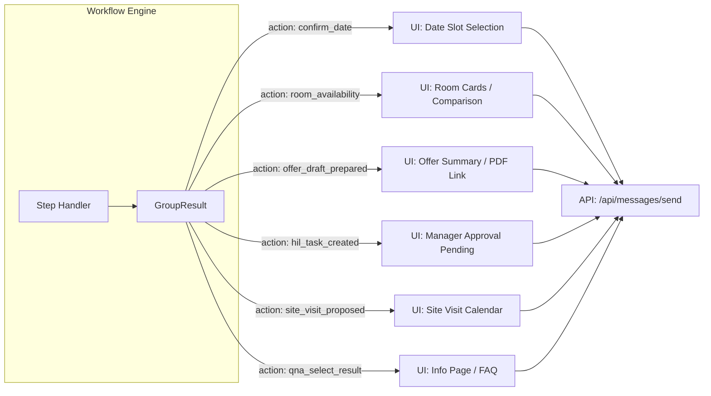

# OpenEvent AI Architecture Diagrams

> **Note:** These diagrams are generated using Mermaid.js. They reflect the current architecture as of January 2026.
> Consult `docs/reference/DEPENDENCY_GRAPH.md` for detailed file mapping.

## 1. System Context & High-Level Architecture

This diagram shows how the system interacts with the user and external components.

## 2. Workflow State Machine (Steps 1-7)

The core of the application is a linear state machine with "detour" capabilities.

## 3. Workflow Routing Logic

How the system decides which code module processes an incoming message.

## 4. Detection Logic (Inside a Stage)

Inside each stage (e.g., Intake, Date Confirmation), a multi-layered approach is used to understand the user's intent.

## 5. Detailed Stage Definitions

| Step | Name | Description | Key Actions |
| :--- | :--- | :--- | :--- |
| **1** | **Intake** | Initial contact and requirement gathering. | Extract Event Type, Pax, Date preference. Create Event record. |
| **2** | **Date Confirmation** | Nail down the exact date/time. | Handle "Next Friday", specific dates. Check Calendar. |
| **3** | **Room Availability** | Select specific rooms. | Present options based on Pax/Layout. Handle "Room A vs Room B". |
| **4** | **Offer Review** | Present formal offer/quote. | Generate pricing. Handle "Send me the quote". |
| **5** | **Negotiation** | Refine terms. | Handle price objections, menu changes. |
| **6** | **Transition** | Pre-booking checks (Merged into 5/7). | Verify all details before final confirmation. |
| **7** | **Confirmation** | Final booking. | Send confirmation email. Close lead. |

## 7. User Journey (End-to-End)

This diagram tracks the lifecycle of an event from the perspectives of the **Client** and the **Manager**.

## 8. Action Processing Diagram

How internal `GroupResult.action` types map to system behavior and Frontend UI components.

